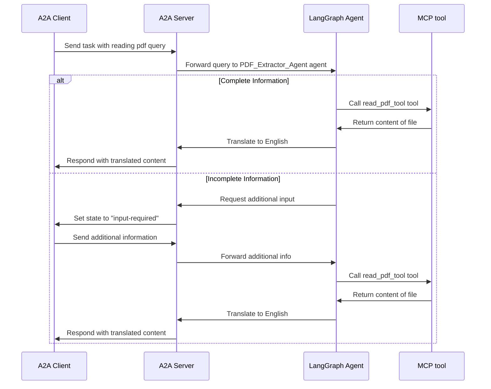

# Introduction
Together, [A2A](https://github.com/google/A2A/tree/main) and [MCP](https://modelcontextprotocol.io/introduction) protocols could enable advanced AI ecosystems where agents equipped with MCP (providing context and tools) collaborate using A2A. Here, I would like to present a simple example. Consider an MCP-powered agent wrapped in A2A named PDF_extract_and_translate_agent that performs the following:
Internal Protocol: Uses MCP to communicate with its underlying LLM. Reads and Translates the PDF content into English.
Key Tool: Has a specific tool (read_pdf_tool) that can ingest a PDF file (given a path) and extract its text content.
A2A Role: Acts as a service provider, offering its PDF reading & translation capability to other agents.

**Scenario: Extracting & translating Information from a PDF**  



## Prerequisites
* I have used [uv](https://docs.astral.sh/uv/) as package manager to set up the project in a MS Windows 11. The A2A libraries we'll be using require python >= 3.12 which uv can install if you don't already have a matching version.   
**Check** 
```bash
echo 'import sys; print(sys.version)' | uv run -
```  
If you see something similar to the following, you are ready to proceed!  
```bash
3.12.7 | packaged by Anaconda, Inc. | (main, Oct  4 2024, 13:17:27) [MSC v.1929 64 bit (AMD64)]
```
* Valid OpenAI credentials

## Setup and running
* Git clone the repository
```bash
git clone https://github.com/hrushikesh-dhumal/mcp_a2a
```

* Navigate to the [mcp-a2a](/mcp_a2a/mcp-a2a/) directory
```bash
cd .\mcp_a2a\mcp-a2a\
```

* Create an environment file (.env) with your API key and the model ID (e.g., "gpt-4.1-nano")::
```bash
OPENAI_API_KEY="your_api_key_here"
OPENAI_CHAT_MODEL_ID="your-model-id"
```
*Optionally you can add tracing using [Langsmith](https://www.langchain.com/langsmith). Its pretty awesome for breaking down the LLM calls.*
```
LANGSMITH_TRACING=true
LANGSMITH_ENDPOINT="https://api.smith.langchain.com"
LANGSMITH_API_KEY="your_api_key_here"
LANGSMITH_PROJECT="your-project-id"
```

* Set up the Python Environment:
```bash
uv python pin 3.12
uv venv
source .venv/bin/activate
```
for windows `source .\.venv\Scripts\activate`

* Run the tool:
```bash
python .\mcp_pdf_server.py
```
This does not print anything in the terminal.

* In a separate terminal, run the agent:
```bash
uv run mcp-a2a
```
The output should look something like this.
```bash
INFO:     Started server process [20840]
INFO:     Waiting for application startup.
INFO:     Application startup complete.
INFO:     Uvicorn running on http://localhost:10002 (Press CTRL+C to quit)
```


* In a separate terminal, run the A2A client:
```bash
uv run google-a2a-cli --agent http://localhost:10002
```
You can then send messages to your server and pressing Enter

```bash
=========  starting a new task ========

What do you want to send to the agent? (:q or quit to exit): Parse the pdf  "sample.pdf"
```
If everything is working correctly you'll see this in the response
```json
"message":{"role":"agent","parts":[{"type":"text","text":"Thank you very much"}]}...
```


## References
1. [A2A tutorial](https://google.github.io/A2A/#/tutorials/python/1_introduction) is an amazing resource for understanding and setup.
2. [blpapi-a2a](https://github.com/djsamseng/blpapi-a2a/tree/main) is a more complex implementation of MCP with A2A.


## Future Work
1. Try alternative for langchain-mcp because of the [error](https://github.com/langchain-ai/langchain-mcp-adapters/issues/78) that makes me declare the agent when it is used.
2. Complex structure of agents created using different libraries and their interaction.
3. Explore other implementations such as [mcpdoc](https://github.com/langchain-ai/mcpdoc)

## Author
Hrushikesh Dhumal
* GitHub: [hrushikesh-dhumal](https://github.com/hrushikesh-dhumal/)
* Medium: [hrushikesh.dhumal](https://medium.com/@hrushikesh.dhumal)
